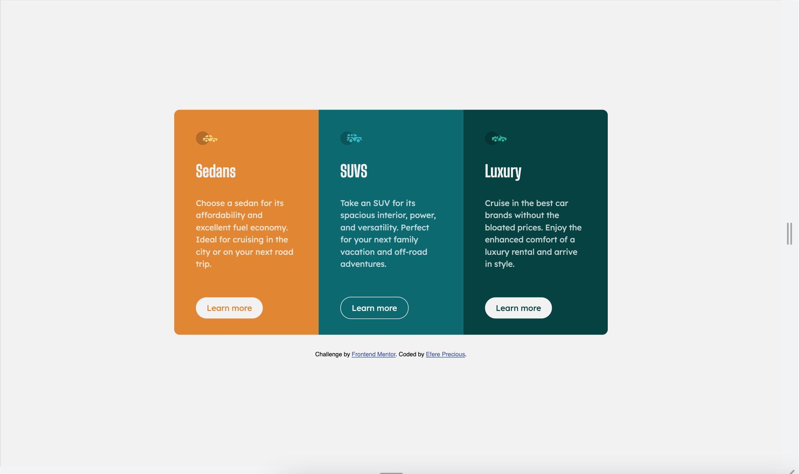
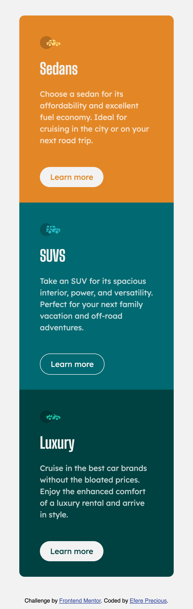

# Frontend Mentor - 3-column preview card component solution

This is a solution to the [3-column preview card component challenge on Frontend Mentor](https://www.frontendmentor.io/challenges/3column-preview-card-component-pH92eAR2-). Frontend Mentor challenges help you improve your coding skills by building realistic projects. 

## Table of contents

- [Overview](#overview)
  - [The challenge](#the-challenge)
  - [Screenshot](#screenshot)
  - [Links](#links)
- [My process](#my-process)
  - [Built with](#built-with)
  
- [Author](#author)

## Overview

### The challenge

Users should be able to:

- View the optimal layout depending on their device's screen size
- See hover states for interactive elements

### Screenshot

- Solution URL: [Github Repo](https://github.com/justEfere/frontend-mentor/tree/main/3-column-card)
- Live Site URL: [live site](https://justefere.github.io/frontend-mentor/3-column-card/)

## My process

### Built with

- Semantic HTML5 markup
- CSS custom properties
- Flexbox
- CSS Grid
- Mobile-first workflow
- [Styled Components](https://fonts.googleapis.com/css2?family=Big+Shoulders+Display:wght@700&family=Lexend+Deca&display=swap) - For font-family

## Author

- Frontend Mentor - [@justEfere](https://www.frontendmentor.io/profile/justEfere)
- Twitter - [@justefere](https://www.twitter.com/justefere)

