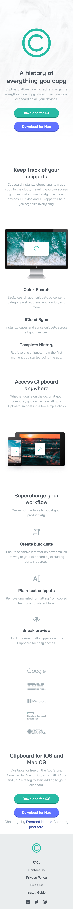

# Frontend Mentor - Clipboard landing page solution

This is a solution to the [Clipboard landing page challenge on Frontend Mentor](https://www.frontendmentor.io/challenges/clipboard-landing-page-5cc9bccd6c4c91111378ecb9). Frontend Mentor challenges help you improve your coding skills by building realistic projects. 

## Table of contents

- [Overview](#overview)
  - [The challenge](#the-challenge)
  - [Screenshot](#screenshot)
  - [Links](#links)
- [My process](#my-process)
  - [Built with](#built-with)
- [Author](#author)

**Note: Delete this note and update the table of contents based on what sections you keep.**

## Overview

### The challenge

Users should be able to:

- View the optimal layout for the site depending on their device's screen size
- See hover states for all interactive elements on the page

### Screenshot

### Links

- Solution URL: [Add solution URL here](https://github.com/justEfere/frontend-mentor/tree/main/Clipboard-Landing-page)
- Live Site URL: [Add live site URL here](https://justefere.github.io/frontend-mentor/Clipboard-Landing-page)

## My process

### Built with

- Semantic HTML5 markup
- CSS custom properties
- Flexbox
- CSS Grid
- Mobile-first workflow
- [Styled Components](https://fonts.googleapis.com/css2?family=Bai+Jamjuree:wght@400;600&display=swap) - For font family

## Author

- Frontend Mentor - [@justEfere](https://www.frontendmentor.io/profile/justEfere)
- Twitter - [@justEfere](https://www.twitter.com/justEfere)

