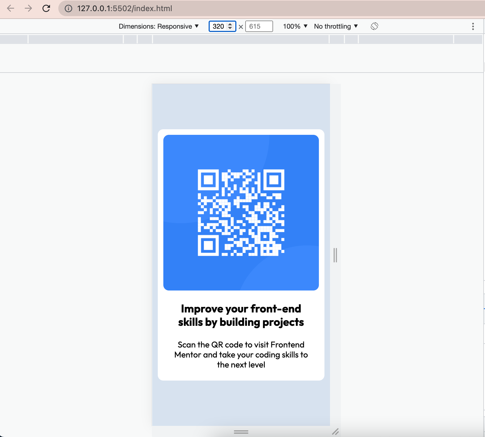
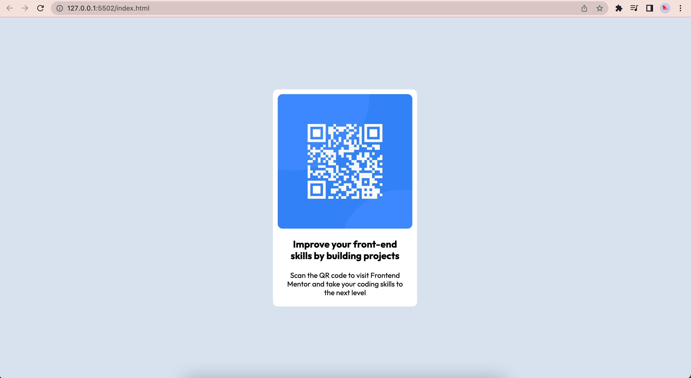

# Frontend Mentor - QR code component solution

This is a solution to the [QR code component challenge on Frontend Mentor](https://www.frontendmentor.io/challenges/qr-code-component-iux_sIO_H). Frontend Mentor challenges help you improve your coding skills by building realistic projects. 

## Table of contents

- [Overview](#overview)
  - [Screenshot](#screenshot)
  - [Links](#links)
- [My process](#my-process)
  - [Built with](#built-with)
  - [What I learned](#what-i-learned)
- [Author](#author)
- [Acknowledgments](#acknowledgments)

## Overview

### Screenshot

### Links

- Solution URL: [Add solution URL here](https://your-solution-url.com)
- Live Site URL: [Add live site URL here](https://your-live-site-url.com)

## My process

### Built with

- Semantic HTML5 markup
- CSS custom properties
- Flexbox
- Desktop-first workflow
- [Styled Components](https://fonts.googleapis.com/css2?family=Outfit:wght@400;700&display=swap) - For font-family

### What I learned

While on this challenge, I learned mostly on how to use Github. Create repositories, static page hosting on github, create folder, files, upload files. I didn't learn anything new on HTML or CSS.

## Author

- Website - [Add your name here](https://www.your-site.com)
- Frontend Mentor - [@justefere](https://www.frontendmentor.io/profile/justEfere)

## Acknowledgments

Big thank you to Kenny Yip Coding youtube channel on how to host page on github. Youtube link below:
https://www.youtube.com/watch?v=OltY8JIaP-4

