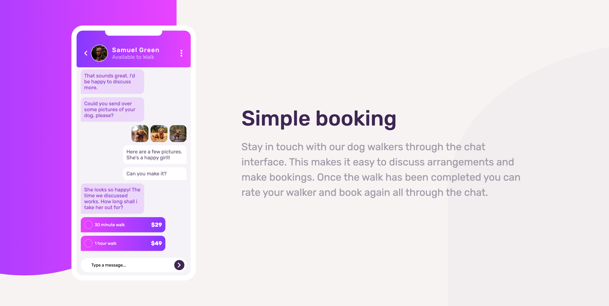
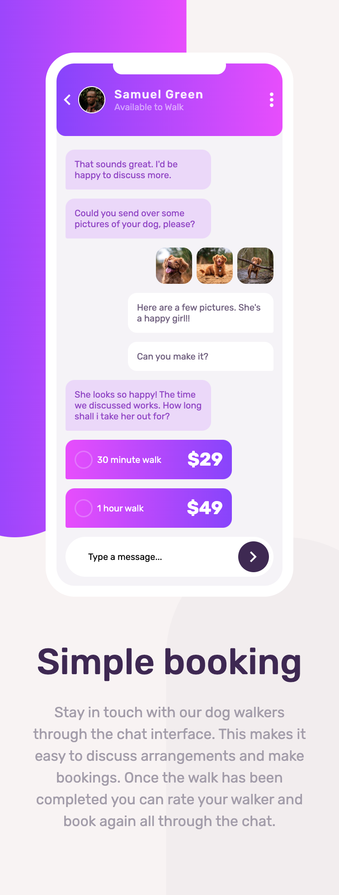

# Frontend Mentor - Chat app CSS illustration solution

This is a solution to the [Chat app CSS illustration challenge on Frontend Mentor](https://www.frontendmentor.io/challenges/chat-app-css-illustration-O5auMkFqY). Frontend Mentor challenges help you improve your coding skills by building realistic projects. 

## Table of contents

- [Overview](#overview)
  - [The challenge](#the-challenge)
  - [Screenshot](#screenshot)
  - [Links](#links)
- [My process](#my-process)
  - [Built with](#built-with)
  
- [Author](#author)

**Note: Delete this note and update the table of contents based on what sections you keep.**

## Overview

### The challenge

Users should be able to:

- View the optimal layout for the component depending on their device's screen size
- **Bonus**: See the chat interface animate on the initial load

### Screenshot

### Links

- Solution URL: [GitHub](https://github.com/justEfere/frontend-mentor/tree/main/chat-app-illustration)
- Live Site URL: [Live URL](https://justefere.github.io/chat-app-illustration)

## My process

### Built with

- Semantic HTML5 markup
- CSS custom properties
- Flexbox
- CSS Grid
- Mobile-first workflow

**Note: Delete this note and the content within this section and replace with your own plans for continued development.**

- Frontend Mentor - [@justefere](https://www.frontendmentor.io/profile/justefere)
- Twitter - [@justefere](https://www.twitter.com/justefere)

**Note: Delete this note and add/remove/edit lines above based on what links you'd like to share.**

