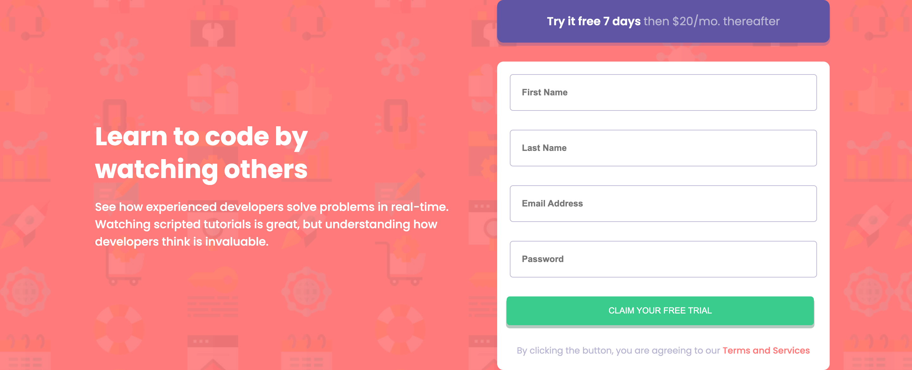

# Frontend Mentor - Intro component with sign up form solution

This is a solution to the [Intro component with sign up form challenge on Frontend Mentor](https://www.frontendmentor.io/challenges/intro-component-with-signup-form-5cf91bd49edda32581d28fd1). Frontend Mentor challenges help you improve your coding skills by building realistic projects.

## Table of contents

- [Overview](#overview)
  - [The challenge](#the-challenge)
  - [Screenshot](#screenshot)
  - [Links](#links)
- [My process](#my-process)
  - [Built with](#built-with)
  - [Continued development](#continued-development)
- [Author](#author)

## Overview

### The challenge

Users should be able to:

- View the optimal layout for the site depending on their device's screen size

### Screenshot

### Links

- Solution URL: [Github repo](https://github.com/justEfere/frontend-mentor/tree/main/intro-component-with-signup-form-master)
- Live Site URL: [Live URL](https://justefere.github.io/frontend-mentor/intro-component-with-signup-form-master)

## My process

### Built with

- Semantic HTML5 markup
- CSS custom properties
- Flexbox
- CSS Grid
- Mobile-first workflow

- [Styled Components](https://fonts.googleapis.com/css2?family=Poppins:wght@400;500;600;700&display=swap) - For font-family

**Note: These are just examples. Delete this note and replace the list above with your own choices**

### Continued development

I have to improve or find efficient way to position element to be responsive. Currently, I can't do that.

## Author

- Frontend Mentor - [@justEfere](https://www.frontendmentor.io/profile/justEfere)
- Twitter - [@justefere](https://www.twitter.com/justefere)
