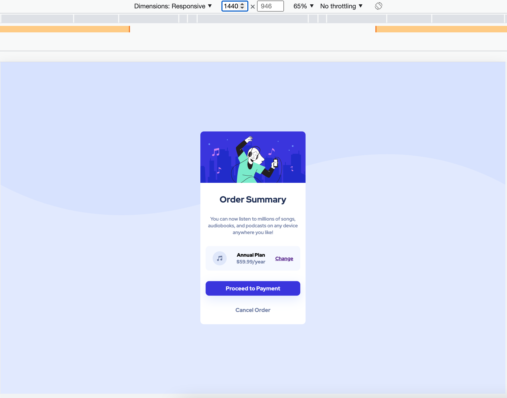

# Frontend Mentor - Order summary card solution

This is a solution to the [Order summary card challenge on Frontend Mentor](https://www.frontendmentor.io/challenges/order-summary-component-QlPmajDUj). Frontend Mentor challenges help you improve your coding skills by building realistic projects. 

## Table of contents

- [Overview](#overview)
  - [The challenge](#the-challenge)
  - [Screenshot](#screenshot)
  - [Links](#links)
- [My process](#my-process)
  - [Built with](#built-with)
  - [What I learned](#what-i-learned)
- [Author](#author)
- [Acknowledgments](#acknowledgments)

**Note: Delete this note and update the table of contents based on what sections you keep.**

## Overview

### The challenge

Users should be able to:

- See hover states for interactive elements

### Screenshot

### Links

- Solution URL: [Add solution URL here](https://github.com/justEfere/frontend-mentor/tree/main/order-summary)
- Live Site URL: [Add live site URL here](https://justefere.github.io/frontend-mentor/order-summary)

## My process

### Built with

- Semantic HTML5 markup
- CSS custom properties
- Flexbox
- CSS Grid
- Mobile-first workflow
- [Styled Components](https://fonts.googleapis.com/css2?family=Red+Hat+Display:wght@500;700;900&display=swap) - For font-family

### What I learned

Taking a step back to see how to approach is very important and saves alot of time that may be lost trying various solution. Also checking components provided first before proceeding will help with the choice of css and html syntax options to use.

## Author

- Website - [Efere Precious](https://justefere.github.io/frontend-mentor/)
- Frontend Mentor - [@justEfere](https://www.frontendmentor.io/profile/justEfere)
- Twitter - [@justefere](https://www.twitter.com/justefere)

