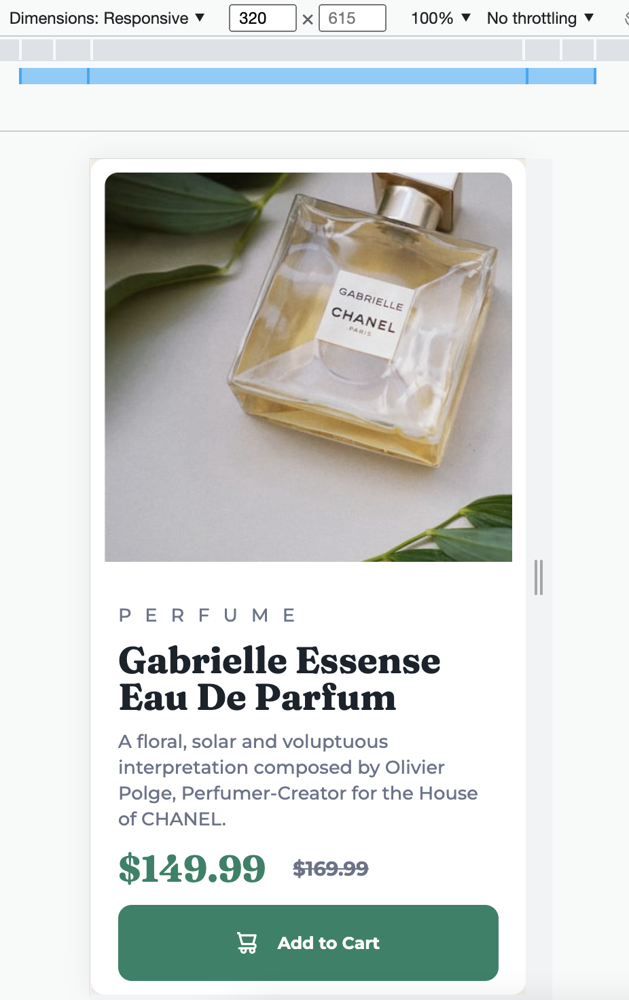
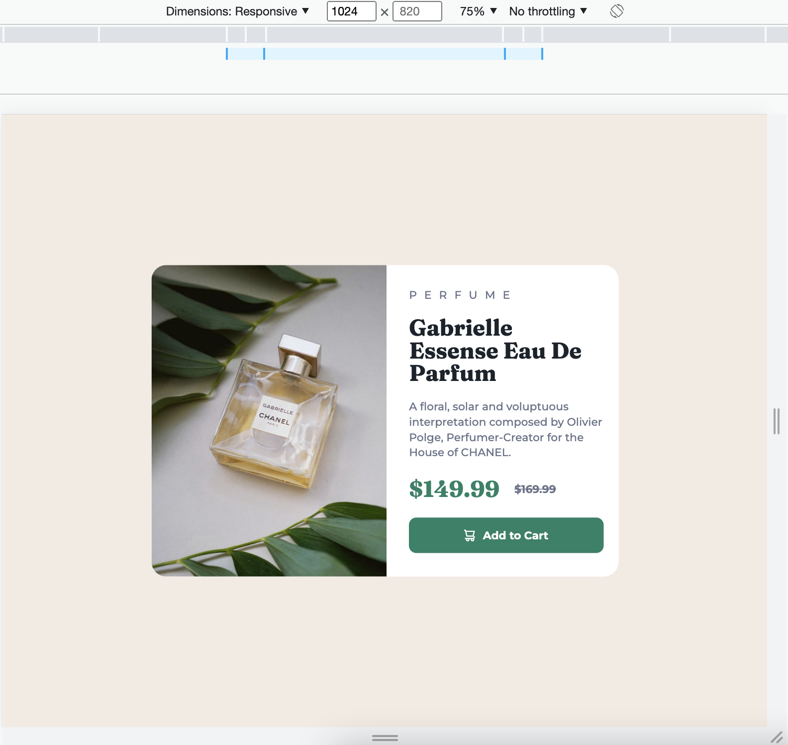

# Frontend Mentor - Product preview card component solution

This is a solution to the [Product preview card component challenge on Frontend Mentor](https://www.frontendmentor.io/challenges/product-preview-card-component-GO7UmttRfa). Frontend Mentor challenges help you improve your coding skills by building realistic projects. 

## Table of contents

- [Overview](#overview)
  - [The challenge](#the-challenge)
  - [Screenshot](#screenshot)
  - [Links](#links)
- [My process](#my-process)
  - [Built with](#built-with)
  - [What I learned](#what-i-learned)
  - [Continued development](#continued-development)
  - [Useful resources](#useful-resources)
- [Author](#author)
- [Acknowledgments](#acknowledgments)

**Note: Delete this note and update the table of contents based on what sections you keep.**

## Overview

### The challenge

Users should be able to:

- View the optimal layout depending on their device's screen size
- See hover and focus states for interactive elements

### Screenshot

### Links

- Solution URL: [Add solution URL here](https://github.com/justEfere/frontend-mentor/tree/main/product-preview-card)
- Live Site URL: [Add live site URL here](https://justefere.github.io/frontend-mentor/product-preview-card/)

## My process

### Built with

- Semantic HTML5 markup
- CSS custom properties
- Flexbox
- CSS Media Querry
- Desktop-first workflow
- [Styled Components](<link href="https://fonts.googleapis.com/css2?family=Fraunces:wght@700&family=Montserrat:wght@500;700&display=swap") - For font family

### What I learned

I learned how to properly use the CSS media querry for responsive design. I wanted to use image tag srset which I looked up for alternative on how to switch the image for different mobile or desktop... I quickly found out it was an overkill and opted for background-image property instead, switching image on response to screen size.

### Continued development

I'm not yet confortable with responsiveness which I have to work on from now on. 

### Useful resources

- [Responsive image srcset](https://developer.mozilla.org/en-US/docs/Learn/HTML/Multimedia_and_embedding/Responsive_images) - This helped me gain more insight on how to use img srcset. I really liked this pattern and will use it going forward.
- [CSS Media Query](https://www.w3schools.com/cssref/css3_pr_mediaquery.php) - This page have immersely assisted me with both documentation and preview examples. I'd recommend it to anyone still learning this concept.

## Author

- Website - [Add your name here](https://justefere.github.io)
- Frontend Mentor - [@justefere](https://www.frontendmentor.io/profile/justEfere)

## Acknowledgments

Thanks to w3schools.com for the free resources and practical examples. Salut!!

