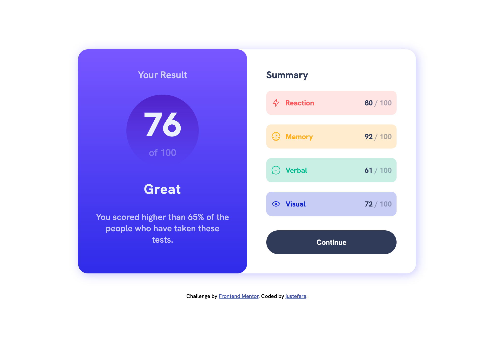
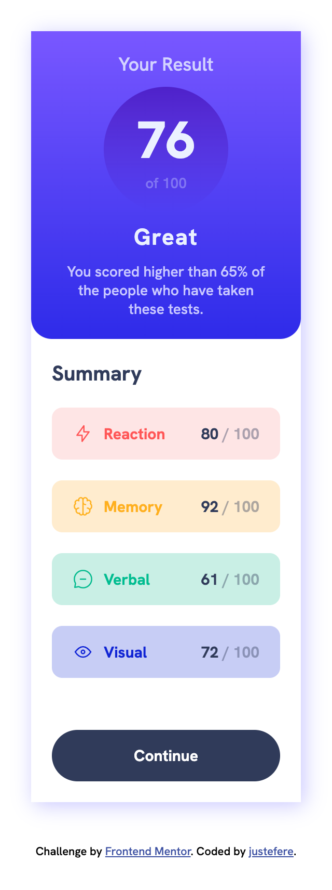

# Frontend Mentor - Results summary component solution

This is a solution to the [Results summary component challenge on Frontend Mentor](https://www.frontendmentor.io/challenges/results-summary-component-CE_K6s0maV). Frontend Mentor challenges help you improve your coding skills by building realistic projects. 

## Table of contents

- [Overview](#overview)
  - [The challenge](#the-challenge)
  - [Screenshot](#screenshot)
  - [Links](#links)
- [My process](#my-process)
  - [Built with](#built-with)
  - [What I learned](#what-i-learned)
  - [Continued development](#continued-development)
  - [Useful resources](#useful-resources)
- [Author](#author)
- [Acknowledgments](#acknowledgments)

**Note: Delete this note and update the table of contents based on what sections you keep.**

## Overview

### The challenge

Users should be able to:

- View the optimal layout for the interface depending on their device's screen size
- See hover and focus states for all interactive elements on the page

### Screenshot

### Links

- Solution URL: [Github Repo](https://github.com/justEfere/frontend-mentor/tree/main/results-summary-component)
- Live Site URL: [live site](https://justefere.github.io/frontend-mentor/results-summary-component)

## My process

### Built with

- Semantic HTML5 markup
- CSS custom properties
- Flexbox
- CSS Grid
- Mobile-first workflow

- [Styled Components](https://fonts.googleapis.com/css2?family=Hanken+Grotesk:wght@500;700;800&display=swap) - For font-family

**Note: These are just examples. Delete this note and replace the list above with your own choices**

### What I learned

## Author

- Frontend Mentor - [@justEfere](https://www.frontendmentor.io/profile/justEfere)
- Twitter - [@justefere](https://www.twitter.com/justefere)

