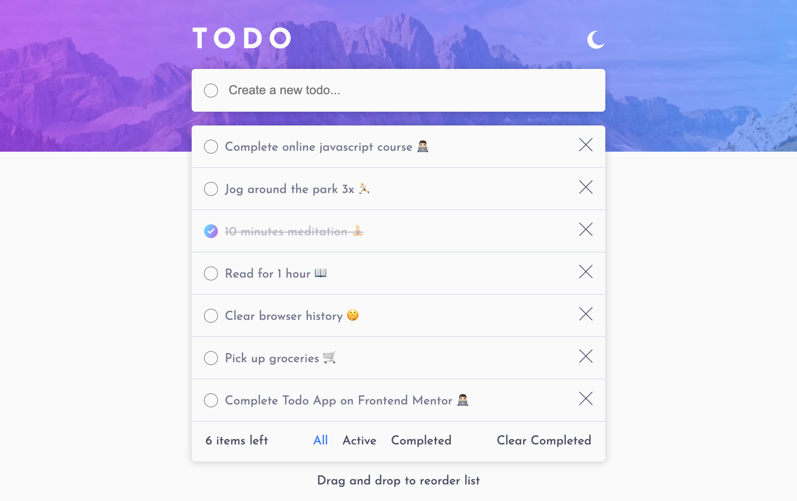
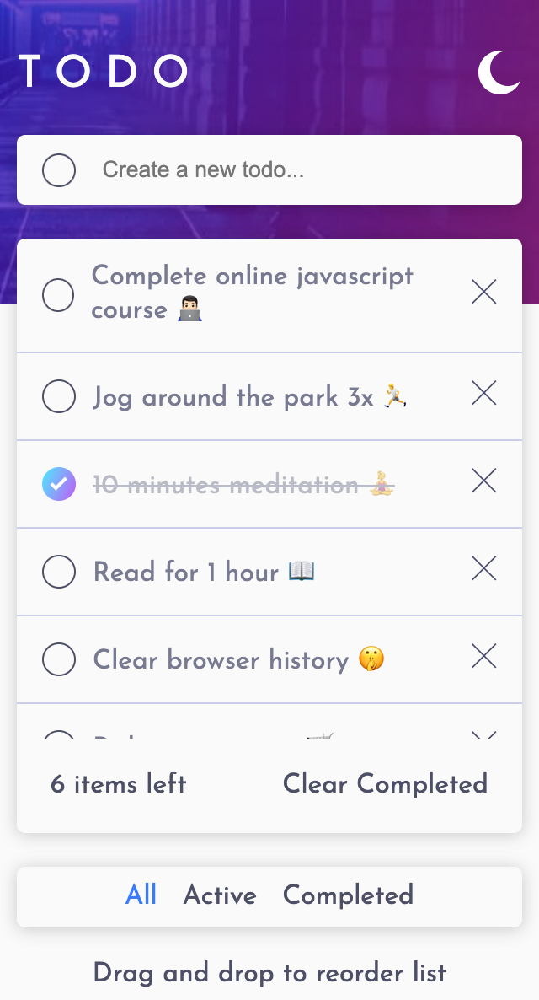

# Frontend Mentor - Todo app solution

This is a solution to the [Todo app challenge on Frontend Mentor](https://www.frontendmentor.io/challenges/todo-app-Su1_KokOW). Frontend Mentor challenges help you improve your coding skills by building realistic projects.

## Table of contents

- [Overview](#overview)
  - [The challenge](#the-challenge)
  - [Screenshot](#screenshot)
  - [Links](#links)
- [My process](#my-process)
  - [Built with](#built-with)
  - [What I learned](#what-i-learned)
  - [Continued development](#continued-development)
- [Author](#author)

## Overview

### The challenge

Users should be able to:

- View the optimal layout for the app depending on their device's screen size
- See hover states for all interactive elements on the page
- Add new todos to the list
- Mark todos as complete
- Delete todos from the list
- Filter by all/active/complete todos
- Clear all completed todos
- Toggle light and dark mode
- **Bonus**: Drag and drop to reorder items on the list

### Screenshot

### Links

- Solution URL: [Github Repo](https://github.com/justEfere/frontend-mentor/tree/main/todo-app)
- Live Site URL: [Live site](https://justefere.github.io/frontend-mentor/todo-app/)

## My process

### Built with

- Semantic HTML5 markup
- CSS custom properties
- Flexbox
- Mobile-first workflow

### What I learned

Learned how to use the drag and drop web api. Although the drag and drop does not work on mobile because the api doesn't support touch.

### Continued development

I found out some things that are important to consider when building a todo app. This i will definately work on when developing a todo app again. this include; adding a position data to each to do because its seems to be in any position when loaded or reloaded.

## Author

<!-- - Website - [Add your name here](https://www.your-site.com) -->

- Frontend Mentor - [@justefere](https://www.frontendmentor.io/profile/justEfere)
- Twitter - [@justefere](https://twitter.com/justefere)
